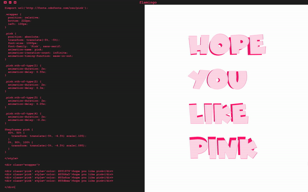

# flamingo-client
lightweight bare bones html markdown editor built on electron and love

## to install

you can download the packaged app [here](flamingo.mazz.tv)

or clone this repository and use npm

    cd flamingo-client
    npm install
    npm start
